# SGX 程序开发基本介绍

## **一，预先准备**

#### **1. 查看机器是否支持 SGX** 

判断机器是否支持 SGX 功能，有2 种方式：

- 通过芯片类型

  根据芯片类型和对应的芯片说明，可以查看是否具有SGX 功能。另外，github上有个程序SGX-hardware，里面列了几乎所有支持SGX的芯片类型，查看一下即可知道。

- 执行程序

  SGX-hardware给了更简单的一种方式，clone下来这个仓库之后，编译
  test-sgx.c 后运行可执行文件，查看执行结果即可以知道，对执行结果的说明可以参考这个程序的README。

  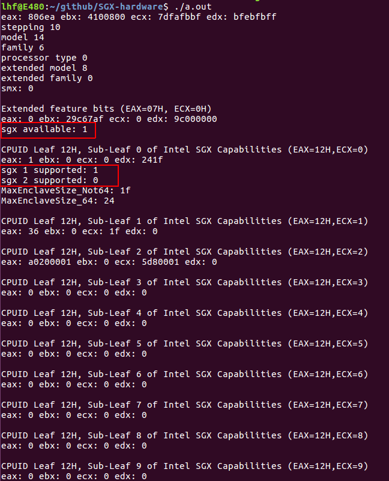


#### **2. BIOS 使能 SGX**

运行SGX 程序，除了要求芯片具有SGX 功能之外，还需要 BIOS 支持。

不同的机器主板对应的进入 BIOS 的方法不同，设置SGX的地方也不同。下面列举 2 种情况：

- 笔记本ThinkPad E480

  主菜单 ADVANCED 下，将 SGX 设置为 ENABLED，然后按 F10 保存退出。

- 台式机 Dell Vostro 

  这台机器的 BIOS 主菜单是列式的（上面E480的主菜单是横式的），大概在中间位置可以看到 SGX 的设置项，设置为 ENABLED，选择容量为128M，保存后退出。


## **二，Ubuntu下使用介绍**

在 Ubuntu 16.04 x64 环境下基于 rust-sgx-sdk 的docker进行开发。 在执行下面步骤之前需要安装好 vim、git、docker。

#### **1.安装 intel 的驱动、sdk、psw等软件环境**

##### 下载

<https://download.01.org/intel-sgx/> 这个网站提供各种版本的sgx软件下载，我们选择最新的 linux-2.4 版本。

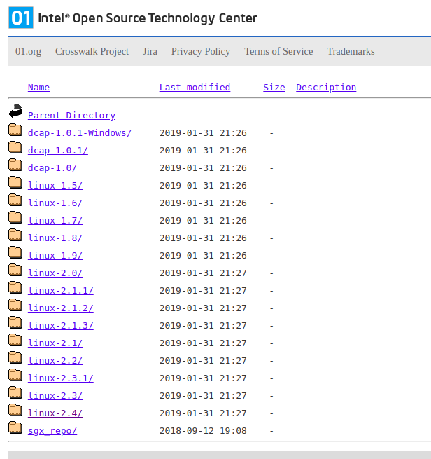


目录下有文档docs和对应于各种 Linux 发行版的软件包， 选择 ubuntu16.04-server。

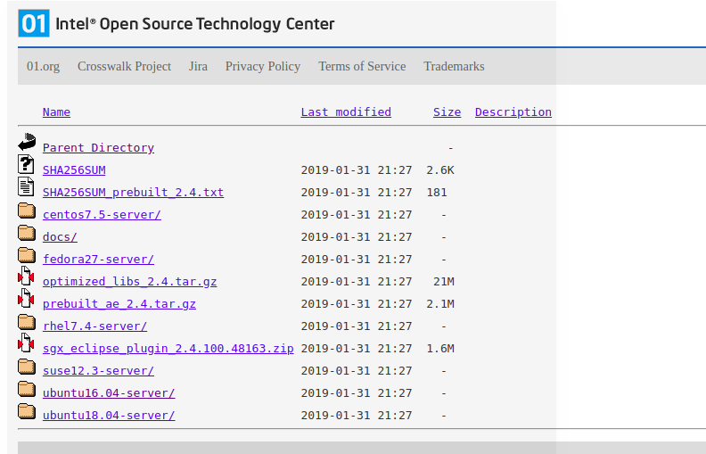

目录下是4 个安装文件，下载所有的内容。

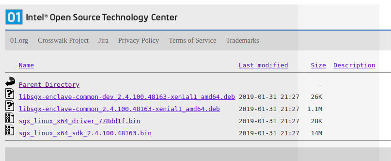


##### 安装

安装的说明文档在 docs目录下

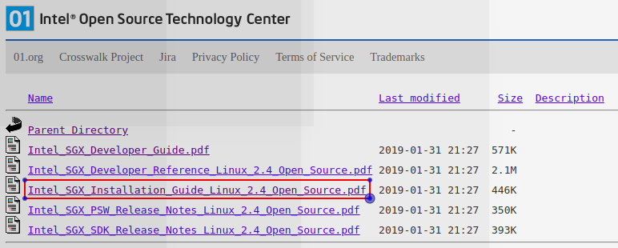


安装执行：

   - 安装驱动：
        - `chmod +x sgx_linux_x64_driver_778dd1f.bin`
        - `sudo ./sgx_linux_x64_driver_778dd1f.bin`

- 装psw：
  - `sudo dpkg -i libsgx-enclave-common_2.4.100.48163-xenial1_amd64.deb`

  - `sudo dpkg -i libsgx-enclave-common-dev_2.4.100.48163-xenial1_amd64.deb`

- 安装 sdk：

  - `chmod +x sgx_linux_x64_sdk_2.4.100.48163.bin`
  - `sudo ./sgx_linux_x64_sdk_2.4.100.48163.bin`


```

**注意**： 

	安装sdk 时会提示“yes/no”, “yes” 表示安装在当前路径下，我们输入“no”，然后输入 “/opt/intel”，让 sdk 和 driver、pwd 都放在 /opt/intel 目录下，方便管理；另外以后的sample 程序中也默认sdk的目录是在 /opt/intel 目录下，如果选择安装在当前目录下，需要修改 Makefile。

```

##### 检查安装是否完成

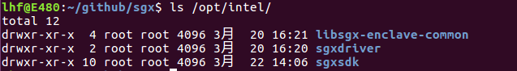


#### **2. 下载 rust-sgx-sdk** 

- `git clone <https://github.com/baidu/rust-sgx-sdk.git`


#### 3. **运行 docker**
- `docker run -v ${PWD}/rust-sgx-sdk:/root/sgx -ti --device /dev/isgx baiduxlab/sgx-rust`

- `/opt/intel/libsgx-encalve-common/aesm/aesm_service`


#### 4. **运行 hello world**

- `cd sgx/samplecode/helloworld/`

- `vim app/app.c`

  ​    将  “This is normal world string passed into enclave” 改为 “hello trias world!”

- `make`

- `cd bin`

- `./app`

显示如下：

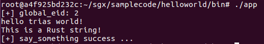


## 三， Windows 下使用介绍

在 Windows 10 下基于 visual studio2017 进行开发。 需要提前安装好 visual studio 2017。

#### **1. 安装 intel 的sdk、psw等软件环境**

##### 下载

在 <https://software.intel.com/en-us/sgx-sdk/download> 有 Windows 上SGX环境的下载

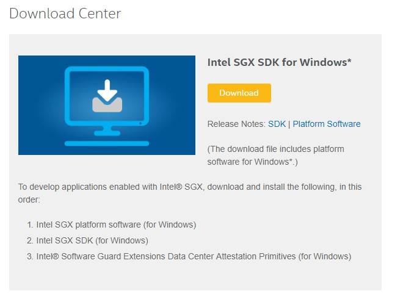

点击Download 需要注册 intel 账户，填写一些信息。

 

然后就可以开始下载，选择 Platform Software 和 SDK。

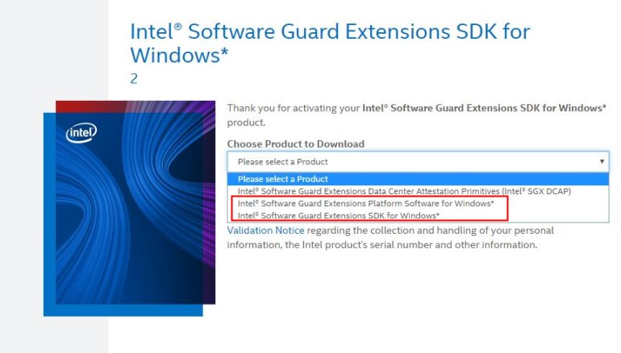

##### 安装

点击 SDK 和 PSW 的安装包，会自动进行解压，解压之后有安装说明文档，按照说明执行安装文件。


**注意：**

- 安装SDK 的过程中会安装 visual studio 的sgx插件。

- Window10 环境下，PSW 不能通过执行文件安装，需要通过 Windows 的自动更新来安装。只要 BIOS 使能了 SGX，Windows Update 就应该会检测到更新，打开控制界面点击安装 intel 的更新即可。


#### **2. 运行 hello world**

##### 新建 SGX Enclave 工程

新建一个 SGX Enclave 工程 sample_enclave

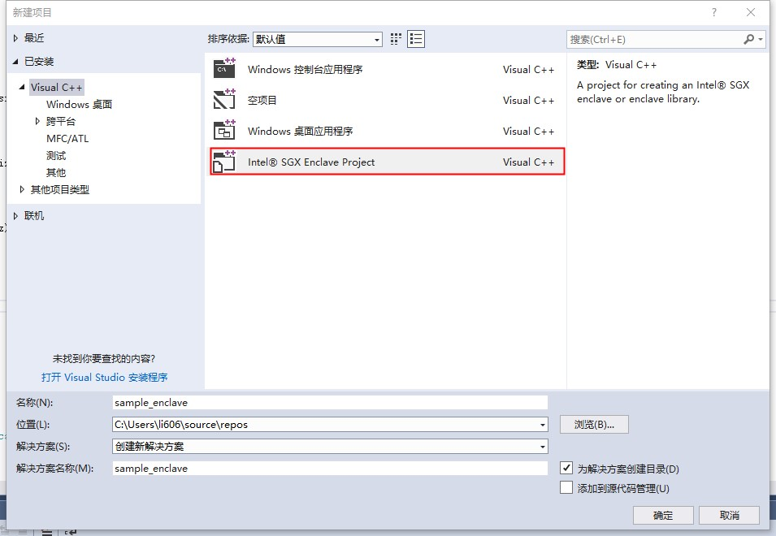

工程结构如下所示

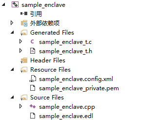

在 sample_enclave.cpp 中添加一个函数

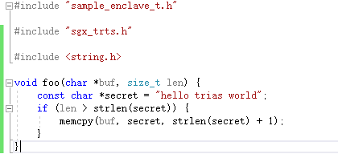


在sample_enclave.edl 中添加相应的接口

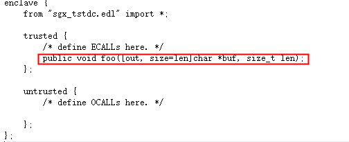


##### 新建控制台工程

新建一个控制台应用程序工程 sgx_sample_app

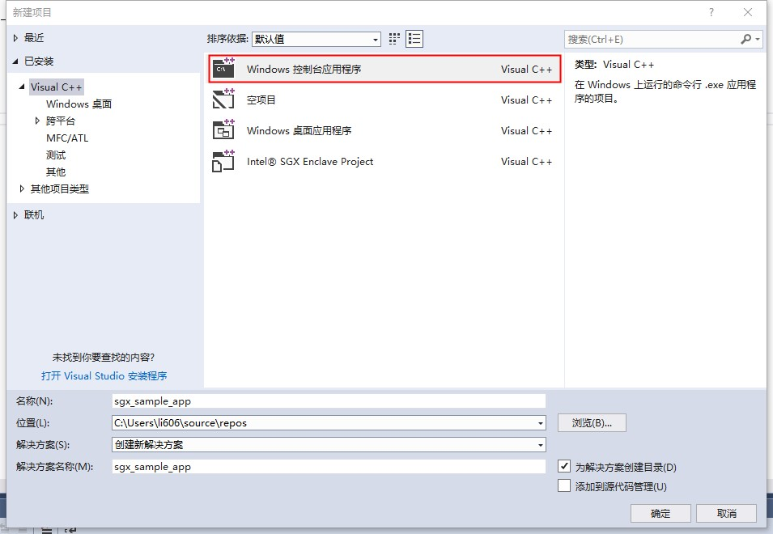


##### 合并两个工程

将上一个工程sample_enclave 添加进来


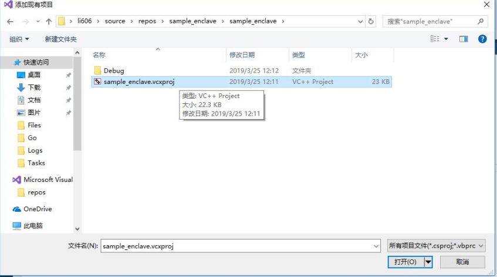


添加 SGX Configuration

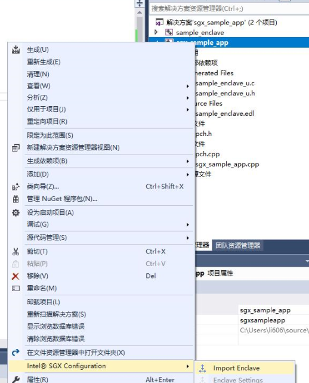

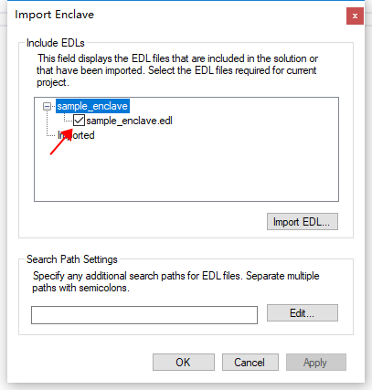


代码结构如下

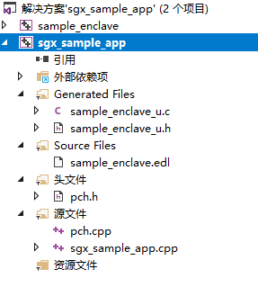

##### 修改代码

在 sgx_sample_app.cpp 中修改 main 函数，调用 sample_enclave 中的 **foo** 函数。

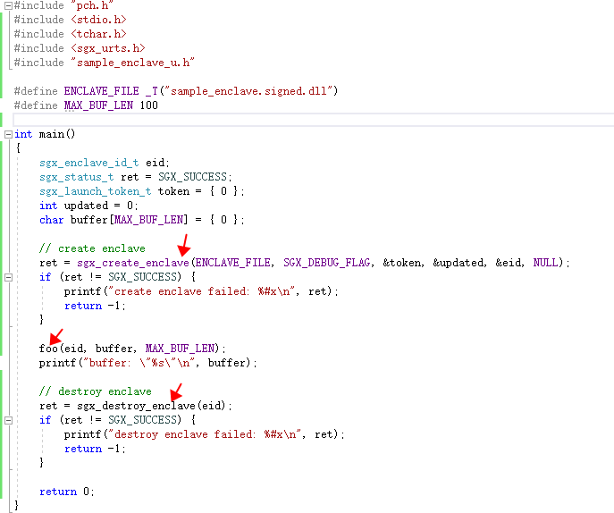


##### 编译生成

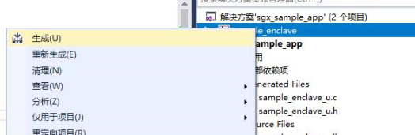


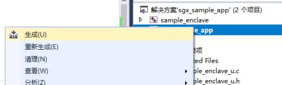


##### 修改配置

工作目录由 ProjectDir 改为 OutDir

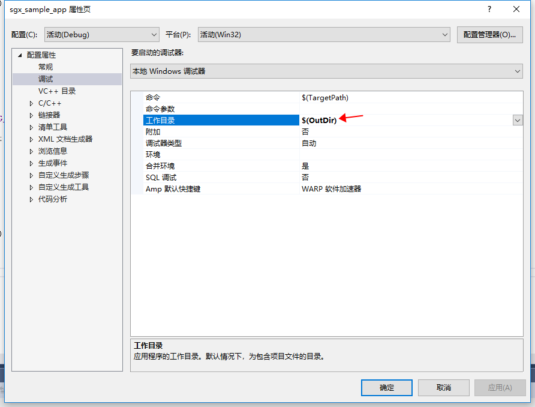

##### 运行

得到结果如下

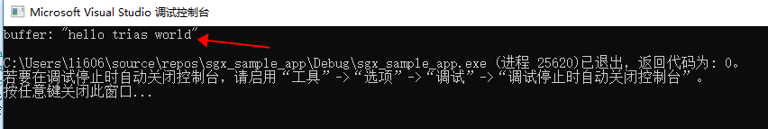


## **四，总结**

​	在 linux 和 windows 系统下，都可以进行 SGX 程序的开发。Intel 提供了官方的驱动、SDK、PSW等软件，是用 c/c++ 语言开发的，开发时使用 c/cpp 编写程序是没有问题的。

​	rust-sgx-sdk 提供了 rust 版本的SDK，还提供了 docker 环境，方便了用户的使用。docker 环境在 Linux 环境下能够方便的运行，在 Windows 能否使用进行使用呢? 由于我本地的 Windows 版本是 Windows 10 家庭版，无法安装 docker（如下图），所以没有实验，如果有需求，我可以找到机器实验一下。

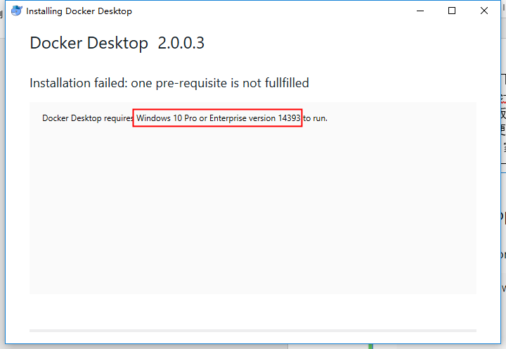

